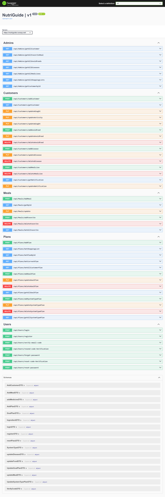
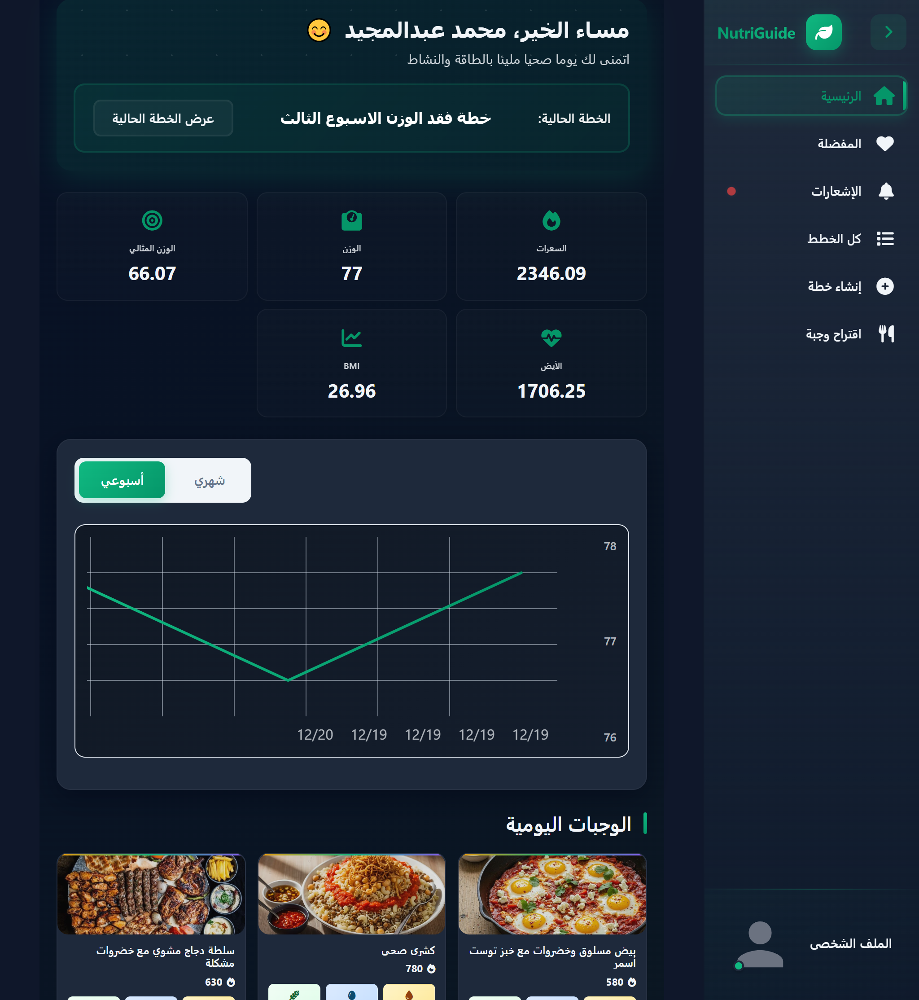
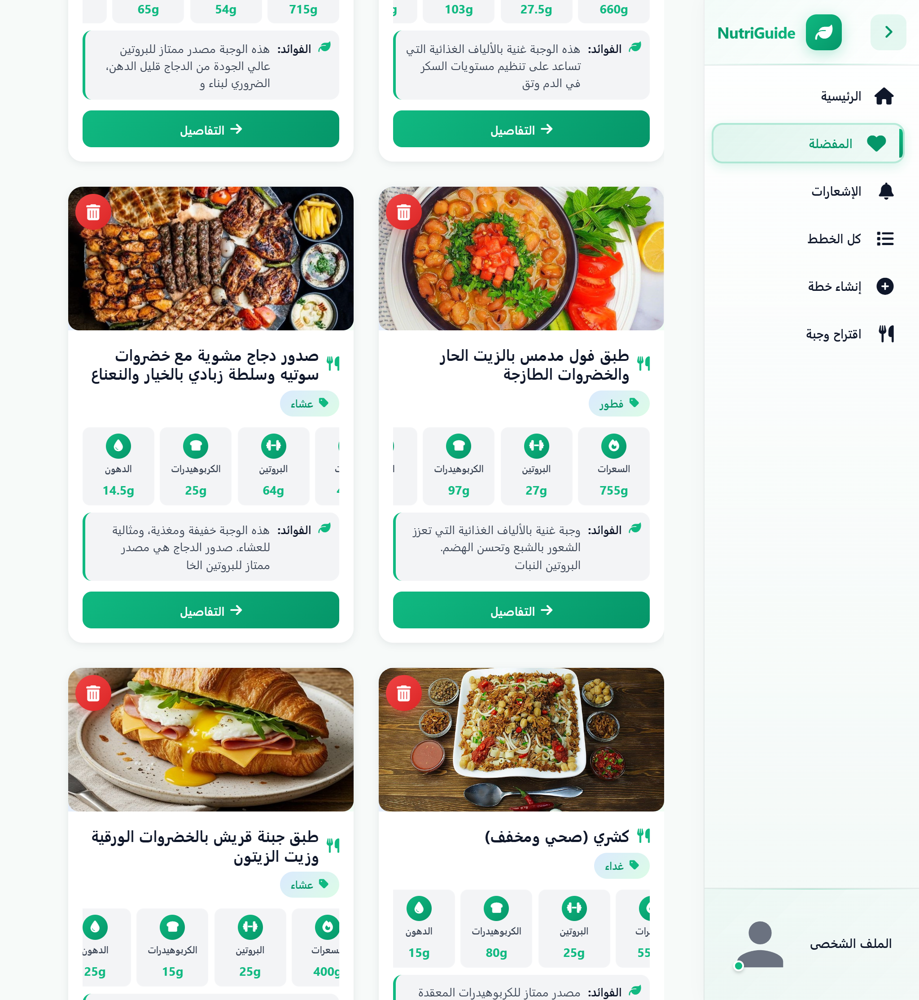
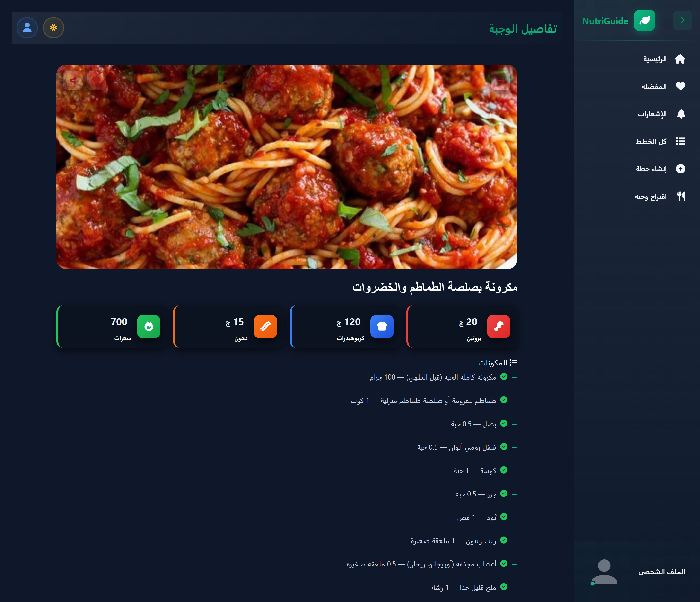

# NutriGuide — Backend

## Overview

NutriGuide is a nutrition and health backend API built with ASP.NET Core. It provides secure, well-documented REST endpoints for managing users, customers, meals, plans, medicines, shopping lists and real-time notifications. The service is designed for scalability, maintainability and integration with a separate front-end client.

## Key Features

- User and customer management (registration, authentication, profiles)
- Meal and ingredient management with many-to-many relationships
- Nutrition and health plans (goal plans, system type plans)
- Medicine schedules and reminders (background service)
- Shopping lists and items management
- Real-time notifications via SignalR
- Well-structured repository and unit-of-work pattern
- Database migrations using Entity Framework Core
- API documentation with Swagger

## Technologies

- Backend: ASP.NET Core Web API
- ORM: Entity Framework Core
- Database: SQL Server
- Real-time: SignalR
- Other: AutoMapper, Background services, Swagger (OpenAPI)

## Repository Structure (high level)

- `Controllers/` — API controllers (Admins, Customers, Meals, Plans, Users, ...)
- `DTOs/` — Data Transfer Objects for requests and responses
- `Models/` — EF Core entities and `NutriGuideDbContext`
- `Repository/` — Generic and specific repositories
- `Services/` — Background services (e.g., medicine reminders) and email service
- `UnitOfWorks/` — Unit of Work implementation
- `Migrations/` — EF Core migrations and snapshot

## Getting Started

Prerequisites:

- .NET 8.0 SDK (or target .NET version listed in the project)
- SQL Server instance

Local setup:

```bash
# Restore and build
dotnet restore NutriGuide/NutriGuide.csproj
dotnet build NutriGuide/NutriGuide.csproj

# Update connection string in NutriGuide/appsettings.json or appsettings.Development.json
# Run EF Core migrations (example):
dotnet ef database update --project NutriGuide --startup-project NutriGuide

# Run the API
dotnet run --project NutriGuide
```

After the API is running, open the Swagger UI (by default) at: `https://localhost:{port}/swagger` to explore endpoints. A screenshot is included above.

## Screenshots

Below are screenshots from the application UI and API documentation. Click any image to view full size.

- 
- 
- 
- 

## Demo Video

A short demo video is included. Click the link below to download or view the video:

- [Download Demo Video](Nurtiguide.mp4)

## API Documentation

The project uses Swagger / OpenAPI to provide interactive API documentation. Use the Swagger UI to view available endpoints, request/response schemas and to execute calls for testing.

## Live Demo

The front-end live demo is hosted on Vercel. Open the link below to view the public demo (login page):

- https://nutri-guide-olive.vercel.app/login

## Portfolio

The complete project demo and video walkthrough are featured on the creator's portfolio:

- [Mohamed Abdelmajeed Portfolio](https://mohamed-abdelmajeed-portfolio.vercel.app/)

*The demo video is hosted live on the portfolio site.*

## Front-End Repository

The front-end source code for this project is available on GitHub:

- [NutriGuide Front-End (GitHub)](https://github.com/Mohamed-Abdulmajeed/NutriGuide)


## Database & Migrations

This project uses EF Core Migrations found in the `Migrations/` folder. Keep migrations in source control and apply them during deployment or development with `dotnet ef database update`.

## Development Notes

- Follow the repository and unit-of-work patterns in `Repository/` and `UnitOfWorks/` for data access.
- Background tasks (e.g., medicine reminders) run as hosted services under `Services/`.
- Map profiles and object mappings are configured in `MapConfigs/`.

## Contributing

1. Fork the back-end repository and create a feature branch.
2. Add tests for new functionality where appropriate.
3. Create a clear PR with description and related issue reference.
4. For front-end contributions, see the [NutriGuide Front-End Repository](https://github.com/Mohamed-Abdulmajeed/NutriGuide).

## Contact

For questions or collaboration, contact the project owner or open an issue in the repository.

---

_This README was generated and organized for clarity. If you'd like a different layout or more detail (examples, curl commands, deployment steps), tell me which sections to expand._
